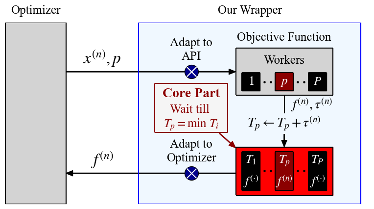

# A Simulator for Multi-Fidelity or Parallel Optimization Using Tabular or Surrogate Benchmarks

[](https://github.com/nabenabe0928/mfhpo-simulator)
[](https://codecov.io/gh/nabenabe0928/mfhpo-simulator)

## Motivation

<table>
    <tr>
        <td></td>
    </tr>
    <tr>
        <td></td>
    </tr>
</table>

When we run parallel optimization experiments using tabular or surrogate benchmarks, each evaluation must be ordered based on the runtime that each configuration, in reality, takes.
However, the evaluation of tabular or surrogate benchmarks, by design, does not take long.
For this reason, the timing of each configuration taken into account must be ordered as if we evaluated each configuration.

In this package, we automatically sort out this problem by pending to pass the hyperparameter configurations to be evaluated internally, and in turn, we obtain the right order of each hyperparameter configuration to be evaluated.
If the optimizer interface is the [ask-and-tell](https://optuna.readthedocs.io/en/stable/tutorial/20_recipes/009_ask_and_tell.html) interface, users can pass the optimizer to a simulator directly and the simulator automatically performs the optimization loop as if function calls are run in parallel.

| Arguments | What Wrapper | Function Call | Requirements | Benefits | Downsides |
|--|:--:|:--:|--|--|--|
| Default | Function  | Parallel | Optimizer does intra-process synchronization (e.g. [DEHB](examples/dehb.py) and [SMAC3](examples/smac.py)) | No need to change the optimizer interface and reproduce exactly how optimizers run | Could be very slow, unstable, and memory-intensive with a large `n_workers` |
|`launch_multiple_wrappers_from_user_side=True`  | Function  | Parallel | Optimizer does inter-process synchronization (e.g. [NePS](examples/neps.py) and [BOHB](examples/bohb.py)) | Same above | Same above |
|`ask_and_tell=True` | Function and Optimizer | *Sequential | Optimizer must take the [ask-and-tell](https://optuna.readthedocs.io/en/stable/tutorial/20_recipes/009_ask_and_tell.html) interface (see [example](examples/ask_and_tell/)) | Fast, stable, and memory-efficient even with a large `n_workers` | Force the ask-and-tell interface and may unexpectedly ignore the memory bottleneck that could be caused by parallel runs |

\* It runs function call sequentially, but function calls are internally processed as if they are run in parallel.

While users do not have to change the interface of optimizers for `ask_and_tell=False` and only need to change the interface of objective function, users may need to change the interface of both for `ask_and_tell=True`.
In principle, `ask_and_tell=True` requires optimizers to be the ask-and-tell interface.
In exchange for the strict constraint, it stabilizes the simulation.

**NOTE**

Our wrapper assumes that none of the workers will not die and any additional workers will not be added after the initialization.
Therefore, if any workers die, our current wrapper hangs and keeps warning except we provide `max_waiting_time` for the instantiation.
We are not sure if we will support any additional workers after the initialization yet.
Furthermore, our package **cannot be run on Windows OS** because the Python module `fcntl` is not supported on Windows OS.
Although our package supports MacOS, it is advisable to use Linux system.

## Setup

The installation is easily done by `pip-install`:

```shell
$ pip install mfhpo-simulator
```

The requirements are:
- Unix system
- Python 3.8 or later

The dependencies of this package are only **numpy** and **ujson**. 

## Usage

We first note that this example is based on [examples/random_with_dummy.py](examples/random_with_dummy.py).
After `pip install mfhpo-simulator`, you can test it with:

```shell
$ python -m examples.random_with_dummy
```

Suppose a user have the following optimizer and objective function:

```python
from __future__ import annotations

import multiprocessing
from typing import Any

import numpy as np


class RandomOptimizer:
    def __init__(self, func: callable, n_workers: int, n_evals: int, value_range: tuple[float, float], seed: int = 42):
        self._func = func
        self._n_workers = n_workers
        self._n_evals = n_evals
        self._rng = np.random.RandomState(seed)
        self._lower, self._upper = value_range

    def optimize(self) -> list[float]:
        pool = multiprocessing.Pool(processes=self._n_workers)

        _results = []
        for i in range(self._n_evals):
            x = self._rng.random() * (self._upper - self._lower) + self._lower
            _results.append(pool.apply_async(self._func, args=[x]))

        pool.close()
        pool.join()
        return [r.get() for r in _results]


def dummy_func(x: float) -> float:
    # NOTE: Let's assume that the actual runtime here is huge, but we can query a pre-recorded result in a fraction
    # e.g. actual_runtime = loss * 1e3
    return x ** 2
```

Then users can run random search as follows:

```python
import time


def dummy_func_wrapper(x: float) -> float:
    loss = dummy_func(x)
    actual_runtime = loss * 1e3
    # NOTE: dummy_func needs to wait internally for the actual runtime to simulate asynchronous optimization
    time.sleep(actual_runtime)
    return loss


results = RandomOptimizer(func=dummy_func_wrapper, n_workers=4, n_evals=100, value_range=(-5.0, 5.0)).optimize()
```

Then our wrapper requires some modifications in signatures of the input of the objective function and the return of our wrapper as follows:

```python
from __future__ import annotations

from typing import Any

from benchmark_simulator import ObjectiveFuncWrapper


def dummy_func_wrapper(eval_config: dict[str, Any], **kwargs) -> dict[str, float]:
    # 0. Adapt the function signature to our wrapper interface
    loss = dummy_func(x=eval_config["x"])
    # For our wrapper, we do not need to wait internally!
    actual_runtime = loss * 1e3
    # Default: obj_keys = ["loss"], runtime_key = "runtime"
    # You can add more keys to obj_keys then our wrapper collects these values as well.
    return dict(loss=loss, runtime=actual_runtime)


class MyObjectiveFuncWrapper(ObjectiveFuncWrapper):
    # 0. Adapt the callable of the objective function to RandomOptimizer interface
    def __call__(self, x: float) -> float:
        results = super().__call__(eval_config={"x": x})
        return results[self.obj_keys[0]]
```

Using our wrapper, the asynchronous optimization could be simply run as follows:

```python
# 1. Define a wrapper instance (Default is n_workers=4, but you can change it from the argument)
wrapper = MyObjectiveFuncWrapper(obj_func=dummy_func_wrapper)

RandomOptimizer(
    # 2. Feed the wrapped objective function to the optimizer directly
    func=wrapper,
    n_workers=wrapper.n_workers,
    n_evals=wrapper.n_actual_evals_in_opt,
    value_range=(-5.0, 5.0),
).optimize()  # 3. just start the optimization!
```

In principle, the only difference is the input of `func` and it was replaced with `wrapper`.
Then our wrapper automatically sorts out the waiting time internally and all the evaluations are available at `mfhpo-simulator/<save_dir_name>/results.json`. 

## Test Using Various Open Source Optimizers

The very minimal examples are provided in [examples/minimal/](examples/minimal/).
After `pip install -r requirements-for-developer.txt`, you can run these examples by:

```shell
# DEHB
$ python -m examples.minimal.dehb

# BOHB
$ python -m examples.minimal.bohb

# SMAC (It conflicts with the others, so you need to do `pip install -r requirements-for-smac.txt`)
$ python -m examples.minimal.smac

# NePS
$ ./examples/minimal/neps.sh --n_workers 4
```

Note that the environment for SMAC3 is separately defined due to some dependency issues:

```shell
$ pip install -r requirements-for-smac.txt
```

Additionally, we need to increase the `retries` in the following files:
- intensifier/intensifier.py
- facade/abstract_facade.py
- main/config_selector.py
For example, we used `retries=100` to prevent unnecessary termination of executions.

Then you can run various examples:

```shell
# Run BOHB with 4 workers on dataset_id=0 in HPOlib (HPOlib has 4 different datasets)
$ python -m examples.bohb --seed 0 --dataset_id 0 --bench_name hpolib --n_workers 4

# Run DEHB with 4 workers on dataset_id=0 in LCBench (LCBench has 34 different datasets)
$ python -m examples.dehb --seed 0 --dataset_id 0 --bench_name lc --n_workers 4

# Run NePS with 4 workers on dataset_id=0 in JAHS-Bench-201 (JAHS-Bench-201 has 3 different datasets)
$ ./examples/neps.sh --seed 0 --dataset_id 0 --bench_name jahs --n_workers 4

# Run SMAC3 with 4 workers on Hartmann (Hartmann has 3 or 6 dimensions)
$ python -m examples.smac --seed 0 --dim 3 --bench_name hartmann --n_workers 4
```

Each argument is defined as follows:
1. `--seed` (`int`): The random seed to be used.
2. `--bench_name` (`Literal["hpolib", "jahs", "lc", "hartmann", "branin"]`): The benchmark to be used.
3. `--n_workers` (`int`): The number of parallel workers to be used. Too high numbers may crash your system because the specified benchmark dataset must stay on the memory for each process/thread.
4. `--dataset_id` (`Optional[int]`): The dataset ID to be used in the specified dataset (0 to 3 for HPOlib, 0 to 33 for LCBench, and 0 t0 2 for JAHS-Bench-201). The default value is 0.
5. `--dim` (`Optional[int]`): The dimensionality of the Hartmann function and it is used only Hartmann function. The default value is 3.

Note that `--seed` does not guarantee the reproducitility because of the parallel processing nature.

## Arguments for Function Wrapper

In most packages, users need to use the default setting (`launch_multiple_wrappers_from_user_side=False` and `ask_and_tell=True`).
However, [`BOHB`](https://github.com/automl/hpBandSter/) and [`NePS`](https://github.com/automl/neps/) are exceptions where you need to use `launch_multiple_wrappers_from_user_side=True`.
Basically, we need to use `launch_multiple_wrappers_from_user_side=True` for BOHB and NePS because they explicitly instantiate multiple objective function objects from the user side and each of them has its own main process.
On the other hand, when optimizers use typical multiprocessing/multithreading packages such as `multiprocessing`, `threading`, `concurrent.futures`, `joblib`, `dask`, and `mpi4py`, the main process can easily communicate with each child process, and hence users can stick to the default setting.
Each argument of `ObjectiveFuncWrapper` is the following:
1. `obj_func` (`ObjectiveFuncType`): The objective function to be wrapped. See [`ObjectiveFuncType`](https://github.com/nabenabe0928/mfhpo-simulator/blob/main/benchmark_simulator/_constants.py#L40-L73) for more details,
2. `launch_multiple_wrappers_from_user_side` (`bool`): Whether users need to launch multiple objective function wrappers from user side,
3. `ask_and_tell` (`bool`): Whether to use an ask-and-tell interface optimizer and simulate the optimization in `ObjectiveFuncWrapper`,
4. `save_dir_name` (`str | None`): The directory to store the information and it must be specified when using `launch_multiple_wrappers_from_user_side=True`, otherwise the directory name will be automatically generated,
5. `n_workers` (`int`): The number of parallel workers,
6. `n_actual_evals_in_opt` (`int`): The number of evaluations inside the optimizers (this argument will be used only for raising an error),
7. `n_evals` (`int`): The number of evaluations to be stored in the information,
8. `continual_max_fidel` (`int | None`): The maximum fidelity value used for the continual evaluation (it is valid only if we have a single fidelity). If `None`, we just do a normal asynchronous or multi-fidelity optimization. Note that continual evaluation is to train each hyperparameter configuration from scratch or from intermediate results. For example, when we have a training result of a neural network with a hyperparameter configuration `A` for 10 epochs, we train a neural network with `A` for 30 epochs from 10 epochs rather than from scratch,
9. `obj_keys` (`list[str]`): The list of objective names in the output from `obj_func`,
10. `runtime_key` (`str`): The key is for runtime. The output of the objective function must include runtime,
11. `fidel_keys` (`list[str]`): The list of fidelity names that will be fed to the objective function,
12. `seed` (`int | None`): The random seed to be used in each worker,
13. `max_waiting_time` (`float`): The maximum waiting time for each worker. If workers wait for the provided amount of time, the wrapper will return only `INF`,
14. `store_config` (`bool`): Whether to store configuration, fidelities, and seed for each evaluation. It consumes much more storage when you use it for large-scale experiments, and
15. `check_interval_time` (`float`): How often each worker should check whether a new job can be assigned to it. For example, if `1e-2` is specified, each worker check whether they can get a new job every `1e-2` seconds. If there are many workers, too small `check_interval_time` may cause a big bottleneck. On the other hand, a big `check_interval_time` spends more time for waiting. By default, `check_interval_time` is set to a relatively small number, so users might rather want to increase the number to avoid the bottleneck for many workers.

## Attributes Provided for Users

### Instance Variables

1. `dir_name` (`str`): The relative path where results will be stored and it returns `./mfhpo-simulator/<save_dir_name>`,
2. `obj_keys` (`list[str]`): The objective names that will be collected in results and the returned dict from users' objective functions must contain these keys. If you want to include the runtime in the results, you also need to include the runtime_key in obj_keys,
3. `runtime_key` (`str`): The runtime name that will be used to define the runtime which the user objective function really took. The returned dict from users' objective functions must contain this key,
4. `fidel_keys` (`list[str]`): The fidelity names that will be used in users' objective functions. `fidels` passed to the objective functions must contain these keys. When `continual_max_fidel=True`, fidel_keys can contain only one key and this fidelity will be used for the definition of continual learning,
5. `n_actual_evals_in_opt` (`int`): The number of configuration evaluations during the actual optimization. Note that even if some configurations are continuations from an existing config with lower fidelity, they are counted as separated config evaluations, and
6. `n_workers` (`int`): The number of workers used in the user-defined optimizer.

`obj_keys`, `runtime_key`, and `fidel_keys` are necessary to match the signature of user-defined objective functions with our API.


### Methods

1. `__call__(self, eval_config: dict[str, Any], *, fidels: dict[str, int | float] | None = None, **data_to_scatter: Any) -> dict[str, float]`

The wrapped objective function used in the user-defined optimizer and valid only if `ask_and_tell=False`.

`eval_config` is the configuration that will be passed to the objective function via our wrapper, but the wrapper does not use this information and it will be used only if `store_config=True` for the storage purpose.

`fidels` is the fidelity parameters that will be passed to the objective function via our wrapper.
If `continual_max_fidel=True`, `fidels` must contain only one name and our wrapper uses the value in `fidels` for continual learning.
Otherwise, our API will not use the information in `fidels` except for the storage purpose for `store_config=True`.

`data_to_scatter` is any information that will be passed to the objective function.
It is especially important when users would like to scatter in-memory large-size data using such as `dask.scatter` because parallel processing in optimizers usually requires serialization and deserialization of the objective function.
We can simply avoid this issue by making the data size of the objective function as small as possible and passing the (in-memory) data to the objective function when it is called.

The return value of the method is `dict[str, float]` where the keys are the union of `[runtime_key]` and `obj_keys` and the values are their corresponding values.

2. `simulate(self, opt: AbstractAskTellOptimizer) -> None`

The optimization loop for the wrapped objective function and the user-defined optimizer and valid only if `ask_and_tell=True`.

Users can simply start the simulation of an optimization using `opt` and `obj_func` via `simulate`.

## Simulation Using Only the Main Process
This is the description for `ask_and_tell=True`.
This class wraps not only a function but also an optimizer so that we can control the right timing of the addition of data to the optimizer and of job allocation.

While `ask_and_tell=False` requires users to wrap objective function and users simply need to pass the wrapped function to the optimizer prepared by users, `ask_and_tell=True` runs the simulation on the application side.
Unlike the other worker wrappers, each objective function will not run in parallel.
Instead, we internally simulate the cumulative runtime for each worker.
For this sake, the provided optimizer must take the so-called **[ask-and-tell](https://optuna.readthedocs.io/en/stable/tutorial/20_recipes/009_ask_and_tell.html)** interface.
As long as the optimizer takes this interface, arbitrary optimizers can be used for this class.
Please check [examples](examples/ask_and_tell/) to know how to encapsulate an optimizer with an incompatible interface.
The benefits of this option are:
1. Very stable because all function calls are performed sequentially and unexpected behavior due to parallel computation will not happen while preserving the same results from the parallel version,
2. No slow down even when using a large `n_workers`, and
3. No huge memory consumption caused by multiple in-memory tabular or surrogate datasets.

You can run the example via:
```shell
$ python -m examples.ask_and_tell.random --bench_name branin --seed 0 --n_workers 4
```

## Citation

Please use the following format for the citation of this repository:

```
@article{watanabe2023mfo-simulator,
  title   = {{P}ython Wrapper for Simulating Multi-Fidelity Optimization on {HPO} Benchmarks without Any Wait},
  author  = {S. Watanabe},
  journal = {arXiv:2305.17595},
  year    = {2023},
}
```
